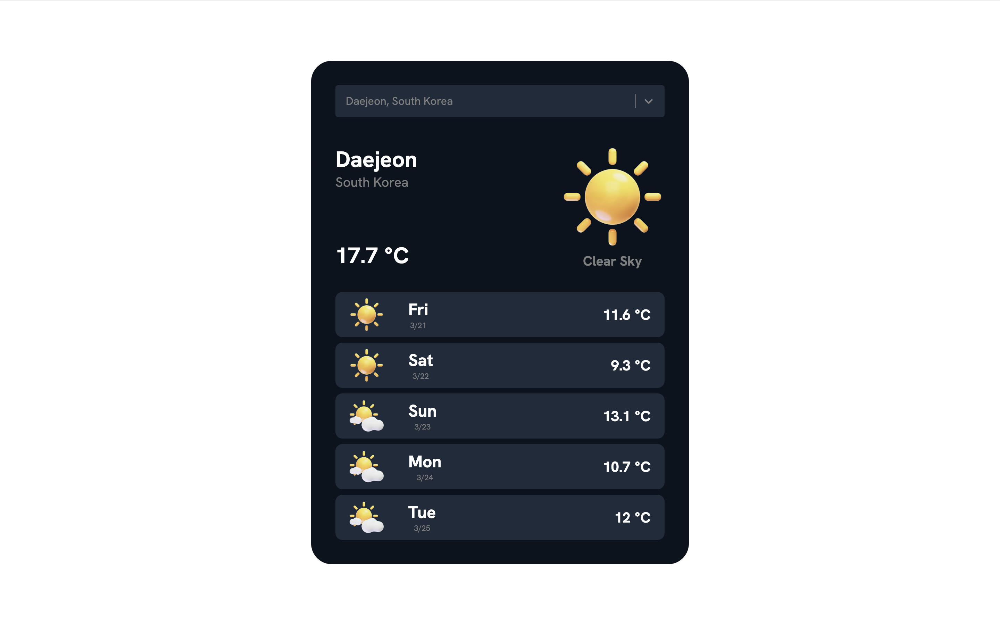

# Weather App



Simple weather forecast app that shows the current weather and a 5-day forecast for a searched location.

## Features
- **City Autocomplete Search**: Users can type city names and select from autocomplete suggestions powered by React Select and Geoapify.
- **Current Weather**: Displays the latest weather conditions for the selected location.
- **5-Day Forecast**: Provides a 5-day weather forecast with temperature and condition.

## Setup

### Prerequisites
- Node.js and npm installed

### Installation
1. Clone the repository:
   ```sh
   git clone https://github.com/heechan2003/weather-app.git
   ```
2. Navigate to the project directory:
   ```sh
   cd weather-app
   ```
3. Install dependencies:
   ```sh
   npm install
   ```
4. Create a `.env` file in the root directory and add your API key:
   ```sh
    VITE_OW_ACCESS_TOKEN=open-weather-api-key-here
    VITE_GA_ACCESS_TOKEN=geoapify-api-key-here
   ```

### Running the App
```sh
npm start
```
The app will be available at `http://localhost:3000/`.

## Technologies Used
- React
- TypeScript
- React Select
- OpenWeather API
- Geoapify API

## License
This project is licensed under the MIT License.